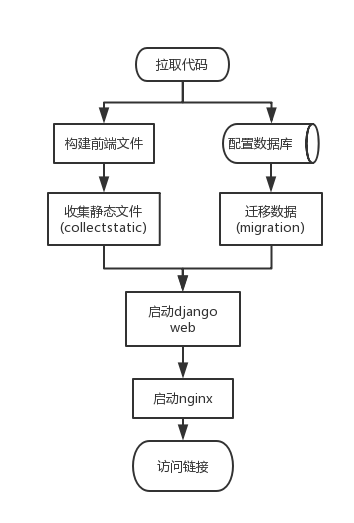

# 使用docker-compose搭建django+vue工程

随着虚拟化技术的发展，越来越多的web工程采用docker进行部署运维。我们尝试使用docker-compose编排一个后端基于django，前端基于vue，数据库为postgresql并使用nginx进行反向代理的web工程。

## 工程准备

### Docker

* [安装Docker](https://docs.docker.com/v17.09/engine/installation/)
* [安装docker-compose](https://docs.docker.com/compose/install/#install-compose)

### django

1. 在python3.7的环境下创建 `django-admin startproject dockerdemo`
2. 修改settings.py文件
   * 修改 `DEBUG=False`
   * `ALLOWED_HOSTS = ['127.0.0.1', 'web']`
   * 将静态文件收集路径添加进 `STATIC_ROOT`，笔者设置为static
   * 添加 `STATICFILES_DIRS`，此项配置后 django 的 `collectstatic` 会在此路径下收集静态文件到 `STATIC_ROOT` 的路径中去。
   * 另外，静态文件的处理笔者采用的是 whitenoise 的方案进行处理，所以需要在中间件中配置一下whitenoise的处理中间件。
        ```python
        'django.middleware.security.SecurityMiddleware',
        'whitenoise.middleware.WhiteNoiseMiddleware',
        ```
   * 同时设置 `STATICFILES_STORAGE = 'whitenoise.storage.CompressedManifestStaticFilesStorage'`
   * 修改数据库信息（可选），针对实际使用的数据库进行配置，也可以采用django默认的sqlite，笔者此处演示了postgresql的简单配置
   * TEMPLATES下的DIRS配置为 `os.path.join(BASE_DIR, 'web', 'dist')`
3. 配置views.py和urls.py将首页设为vue的index.html

### vue

1. 使用vue-cli3创建了一个简单的vue工程
2. 配置 `npm run build` 的静态文件目录到 dist/static 中

### nginx

准备nginx的配置文件，进行端口转发的设置。

## 镜像和编排

我们先确定一下部署一个web工程所需要的环节。在这里笔者绘制了一张流程图。



按照流程图的顺序，我们编写一下Dockerfile和docker-compose.yml

### 数据库

数据库需要先准备一下web工程使用的用户和数据库，这里涉及到一个点，就是如何初始化数据库的问题。这里以postgresql举例。

官方文档中提供了两种示例，一种是配置环境变量：

* POSTGRES_DB
* POSTGRES_USER
* POSTGRES_PASSWORD

另一种是将初始化脚本拷贝进/docker-entrypoint-initdb.d/ 中，镜像在初始化的时候会执行文件夹下的所有脚本，我们可以在脚本中创建数据库和用户。这里给出脚本的一种方式。

```bash
#!/bin/bash
set -e

psql -v ON_ERROR_STOP=1 --username "$POSTGRES_USER" --dbname "$POSTGRES_DB" <<-EOSQL
	CREATE USER $DATABASE_USER;
	CREATE DATABASE $DATABASE_NAME;
	GRANT ALL PRIVILEGES ON DATABASE $DATABASE_NAME TO $DATABASE_USER;
EOSQL
```

需要注意的是，初始化操作尽在第一次build的时候又进行初始化。以后如果终止了docker-compose或者使用 `docker-compose stop`指令之后再启动是不重新初始化的。只有在 `docker-compose down`命令执行过后，再执行启动命令才会进行初始化。

### web

我们的web工程在一个Dockerfile分为构建和运行两部分内容。分别使用node:8镜像作为前端构建的基础镜像和python:3.7作为django工程运行的基础镜像。比较有意思的点在于一份Dockerfile是可以分阶段构建的，也就是可以编写多个FROM并且用as给一个别名，后面的镜像可以通过这个别名获取该镜像的一些内容，比如COPY --from等方式。

#### 前端

前端内容比较简单，就是将代码拷到工作目录下，配置一下淘宝的镜像代理，然后执行 `npm run build` 构建一下前端静态文件即可。

#### django

pip安装一下依赖，另外在安装一下gunicorn。由于如果在windows环境下进行开发，gunicorn是无法安装的，所以我们这里单独放进Dockerfile中进行安装。使用的镜像是清华大学提供的镜像地址。依赖安装完成后，执行一下静态文件的收集指令即可。

### nginx

准备一份配置文件，监听80端口并将接收到的请求全部转发给django工程。笔者准备了比较简单的一份配置文件。其他具体需求还需根据场景进行设置。

```
server {
    listen 80;
    server_name localhost;

    location / {
      proxy_pass http://web:8123;
    }
}
```

### ignore

编写 .dockerignore 文件忽略掉一些不需要打包的文件，如node_modules等。

### docker-compose.yml

这份文件用来编排一个工程，主要内容是上面描述的web, nginx和postgres这3项。除此之外还有一些细节。
* nginx和postgres都需要将数据卷挂载到存放相应配置和数据的地方
* 数据库的相关信息用环境变量来读取，因此我们准备一份.env文件，并通过env_file指定读取的环境变量文件。
* web中我们对command进行了一些设定，延迟8秒是为了等待数据库启动完成。接着进行数据库的数据迁移，最后用gunicorn进行启动。

## 效果

访问 http://localhost/ 或 http://localhost/admin/ 可以查看最终起起来的效果。

## 代码地址

[https://github.com/will4906/dockerdemo](https://github.com/will4906/dockerdemo)

## 参考链接

* https://stackoverflow.com/questions/33322103/multiple-froms-what-it-means
* https://docs.docker.com/v17.09/get-started/part2/#dockerfile
* https://www.cnblogs.com/yanshicheng/p/9452545.html
* https://cloud.tencent.com/developer/ask/81121

